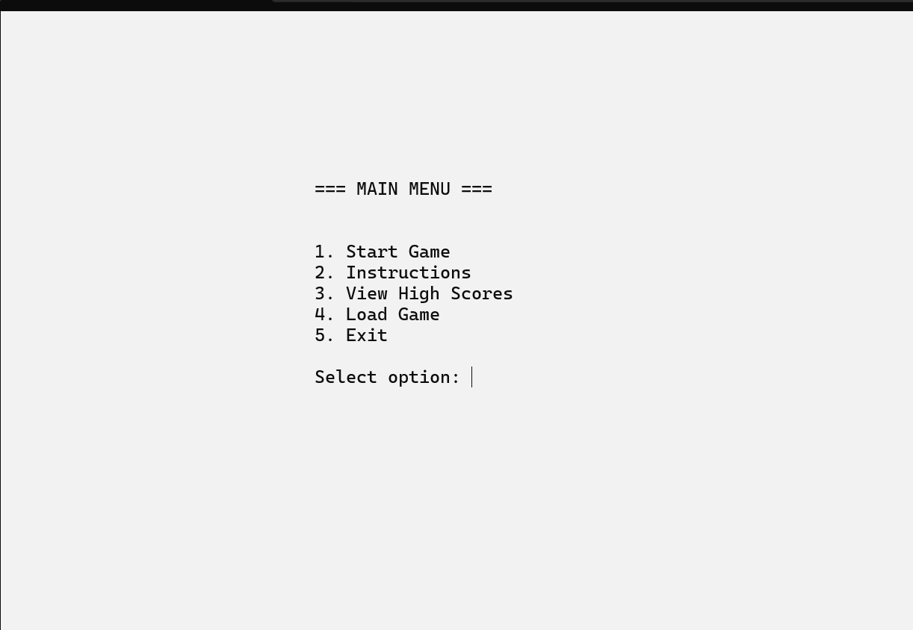
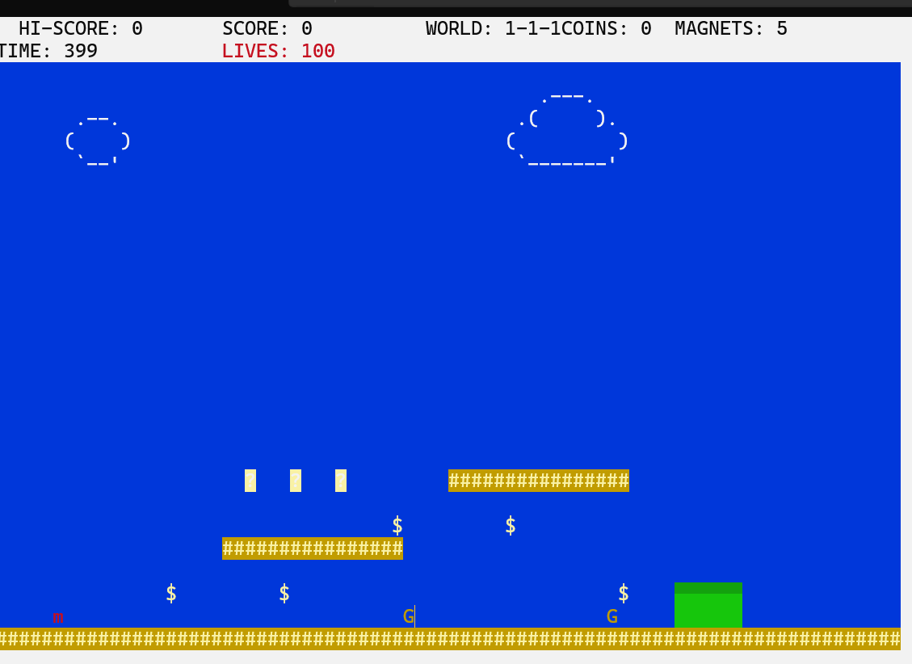
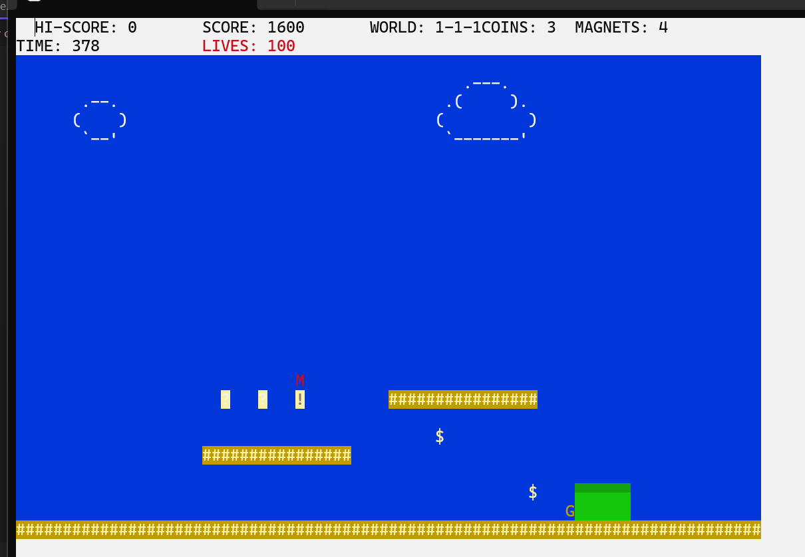
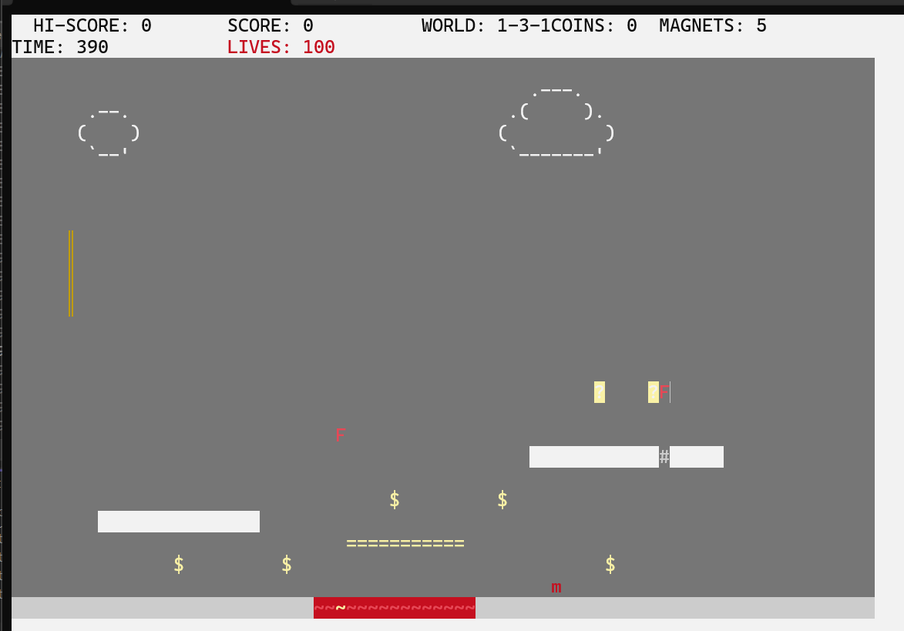
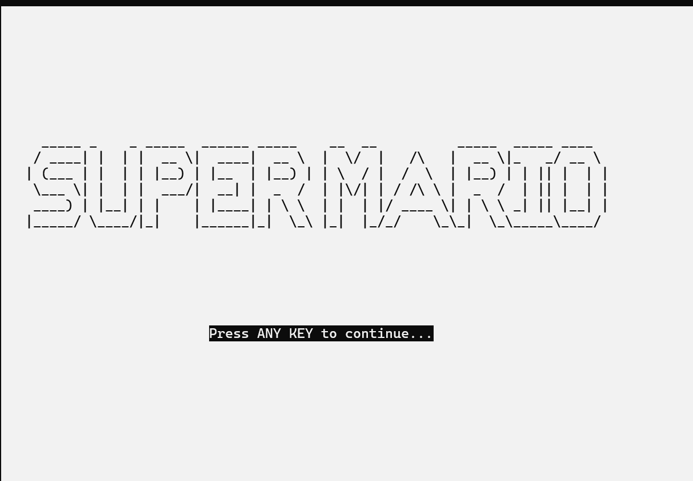

# mario-assembly-game
A Mario-inspired platformer built in x86 MASM Assembly. The game features multiple levels with unique hazards, enemy AI (Goombas, Koopas, Boss), power-ups, fireballs, a hidden room, moving platforms, real-time physics, Windows sound API integration, and persistent high score storage.

## 📸 Screenshots

### Main Menu

### Level 1

### Level 2

### Secret Coin Room

### Boss Level

### Game Intro Screen

